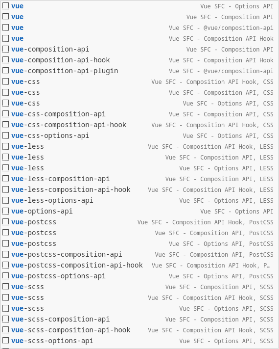
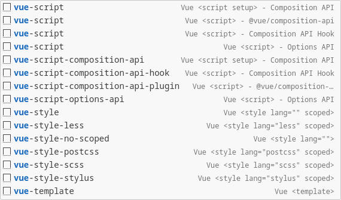
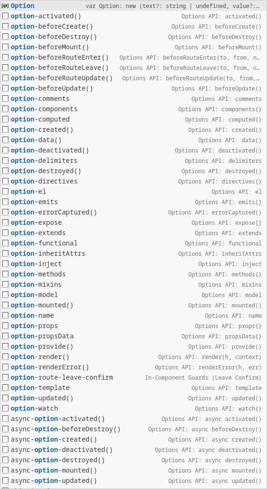
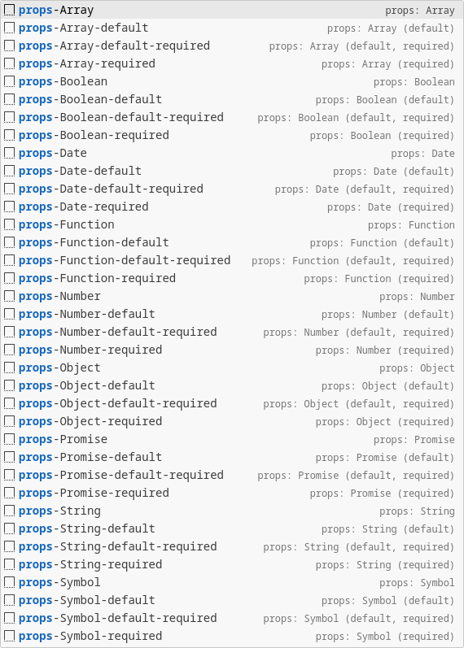
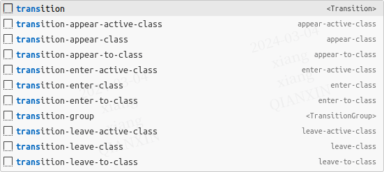
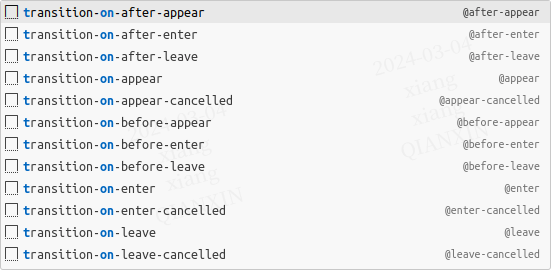
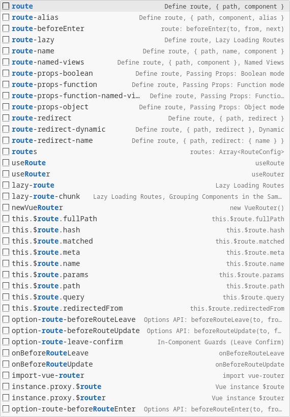
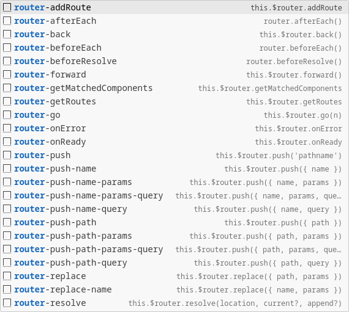
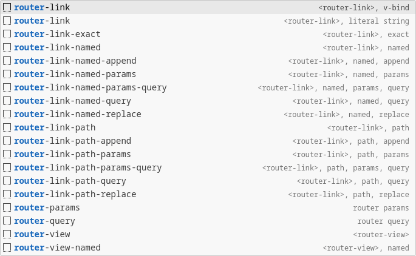

<p>
  <h1 align="center">Vue 2 Snippet (Visual Studio Code)</h1>
</p>

<p align="center">
  <a href="https://github.com/xianghongai/vscode-vue2-snippets">
    
  </a>
  <a href="https://marketplace.visualstudio.com/items?itemName=nicholashsiang.vscode-vue2-snippets">
    
  </a>
  <a href="https://marketplace.visualstudio.com/items?itemName=nicholashsiang.vscode-vue2-snippets">
    
  </a>
  <a href="https://marketplace.visualstudio.com/items?itemName=nicholashsiang.vscode-vue2-snippets">
    
  </a>
  <a href="https://marketplace.visualstudio.com/items?itemName=nicholashsiang.vscode-vue2-snippets">
    
  </a>
</p>

框架，框架，有别于灵活的语言，框架就是限定了各种条条框框，让开发者在限/约定的 API 中做事情；因此，开发者在编码过程中，在框架层面输入的字符要少之有少，应当通过代码片段或 AIGC 快速创建框架相关的代码结构，将更多的精力聚焦在业务逻辑代码上；本扩展就是用于辅助生成框架侧的代码，本扩展提供了 Vue 2 的代码片段，包括 Options API 和 Composition API，同时包含 `@vue/composition-api` 中的 API。理解我的设计之后，几乎没有记忆成本，不是吹，至少能帮助您提升 80% 的效率 ヾ(´︶`*)ﾉ♬

## Introduction 📚

To improve coding efficiency, this extension provides Vue 2 code snippets, including Options API and Composition API, as well as APIs in `@vue/composition-api`;

For example, `beforeCreate` has two triggering methods:

1. Prefix Directly：`olbc` = <strong><u style="color: red;">O</u></strong></strong>ptions API <strong><u style="color: red;">L</u></strong></strong>ifecycle Hooks <strong><u style="color: red;">b</u></strong></strong>efore<strong><u style="color: red;">C</u></strong></strong>reate()
2. Suggest Match：`opbc` = <strong><u style="color: red;">Op</u></strong></strong>tions API <strong><u style="color: red;">b</u></strong></strong>efore<strong><u style="color: red;">C</u></strong></strong>reate()

Why is Prefix `olbc` instead of `opbc`? Because the `op*` prefix will have many conflicts, and using the `ol*` prefix can limit the range.

--

为了减少记忆负担、理解成本，本扩展提供了缩写前缀 (部分)，以及联想匹配前缀 (主要)，方便用户快速输入代码片段。

比如，`beforeCreate` 有两种触发方式：

1. 直接生成 (Prefix)：`olbc` = <strong><u style="color: red;">O</u></strong></strong>ptions API <strong><u style="color: red;">L</u></strong></strong>ifecycle Hooks <strong><u style="color: red;">b</u></strong></strong>efore<strong><u style="color: red;">C</u></strong></strong>reate()
2. 联想匹配 (Suggest Match)：`opbc` = <strong><u style="color: red;">Op</u></strong></strong>tions API <strong><u style="color: red;">b</u></strong></strong>efore<strong><u style="color: red;">C</u></strong></strong>reate()

Prefix 为什么是 `olbc` 而不是 `opbc`？因为 `op*` 前缀会有很多冲突，而使用 `ol*` 前缀能限定为范围；

仅高频常用代码提供**缩写**前缀。

## Snippets 🦢

- Single-File Components / 单文件组件
- Vue Language Blocks / SFC 语法定义
- Options API
- Props Property
- Watch Property (Options API)
- Watch (Composition API)
- Computed
- Lifecycle Hooks (Options API)
- Lifecycle Hooks (Composition API)
- Instance Properties & Methods
- Vue Directives
- Transition & TransitionGroup
- Vue Router v3.x

Recommended editor settings (建议配置编辑器):

```
"editor.inlineSuggest.enabled": true,
"editor.suggestSelection": "first",
"editor.suggest.localityBonus": true,
"editor.suggest.preview": true,
```

### Single-File Components / 单文件组件

The `vue` prefix generates Vue Single-File Components, Some examples:

通过 `vue` 前缀触发，包涵大量创建 Vue 单文件组件的代码片段，部分示例如下：


| Prefix                               | VS Code Suggest Match | Snippet                                                                                                                                                                                                                                                                                                                                                                                                                                                                                                                          |
|--------------------------------------|-----------------------|----------------------------------------------------------------------------------------------------------------------------------------------------------------------------------------------------------------------------------------------------------------------------------------------------------------------------------------------------------------------------------------------------------------------------------------------------------------------------------------------------------------------------------|
| `vue` / <br><br>`vue-options-api`    |                       | \<template\><br>&nbsp;&nbsp;\<div\><br>&nbsp;&nbsp;&nbsp;&nbsp;\<!-- --\><br>&nbsp;&nbsp;\</div\><br>\</template\><br><br>\<script\><br>export default {<br>&nbsp;&nbsp;name: 'TestIndex',<br><br>&nbsp;&nbsp;data() {<br>&nbsp;&nbsp;&nbsp;&nbsp;return {<br>&nbsp;&nbsp;&nbsp;&nbsp;&nbsp;&nbsp;<br>&nbsp;&nbsp;&nbsp;&nbsp;};<br>&nbsp;&nbsp;},<br><br>&nbsp;&nbsp;mounted() {<br>&nbsp;&nbsp;&nbsp;&nbsp;<br>&nbsp;&nbsp;},<br><br>&nbsp;&nbsp;methods: {<br>&nbsp;&nbsp;&nbsp;&nbsp;<br>&nbsp;&nbsp;},<br>};<br>\</script\> |
| `vue` / `vue-composition-api`        |                       | \<template\><br>&nbsp;&nbsp;\<div\><br>&nbsp;&nbsp;&nbsp;&nbsp;\<!-- --\><br>&nbsp;&nbsp;\</div\><br>\</template\><br><br>\<script setup\><br><br>\</script\>                                                                                                                                                                                                                                                                                                                                                                    |
| `vue` / `vue-composition-api-hook`   |                       | \<template\><br>&nbsp;&nbsp;\<div\><br>&nbsp;&nbsp;&nbsp;&nbsp;\<!-- --\><br>&nbsp;&nbsp;\</div\><br>\</template\><br><br>\<script\><br>import { ref } from 'vue';<br><br>export default {<br>&nbsp;&nbsp;setup() {<br>&nbsp;&nbsp;&nbsp;&nbsp;const feature = ref();<br><br>&nbsp;&nbsp;&nbsp;&nbsp;return {<br>&nbsp;&nbsp;&nbsp;&nbsp;&nbsp;&nbsp;<br>&nbsp;&nbsp;&nbsp;&nbsp;};<br>&nbsp;&nbsp;},<br>};<br>\</script\>                                                                                                       |
| `vue` / `vue-composition-api-plugin` |                       | \<template\><br>&nbsp;&nbsp;\<div\><br>&nbsp;&nbsp;&nbsp;&nbsp;\<!-- --\><br>&nbsp;&nbsp;\</div\><br>\</template\><br><br>\<script\><br>import { defineComponent } from '@vue/composition-api';<br><br>export default defineComponent({<br>&nbsp;&nbsp;setup() {<br>&nbsp;&nbsp;&nbsp;&nbsp;<br><br>&nbsp;&nbsp;&nbsp;&nbsp;return {<br>&nbsp;&nbsp;&nbsp;&nbsp;&nbsp;&nbsp;<br>&nbsp;&nbsp;&nbsp;&nbsp;};<br>&nbsp;&nbsp;},<br>});<br>\</script\>                                                                               |
| ...                                  |                       |                                                                                                                                                                                                                                                                                                                                                                                                                                                                                                                                  |

Full prefix screenshot (SFC) / 完整前缀截图 (单文件组件):



### Vue Language Blocks / SFC 语法定义

The `vue-script` prefix generates `<script>` language block, which contains a variety of API style scripting language blocks.

The `vue-style` prefix generates a `<style>` language block, which contains different style preprocessing language blocks.

--

`vue-script` 前缀生成 `<script>` 语言块，包含不同风格脚本语言块；

`vue-style` 前缀生成 `<style>` 语言块，包含不同样式预处理语言块。

| Prefix                                             | VS Code Suggest Match | Snippet                                                                                                                                                                                                                                                                                                                                                                                                |
|----------------------------------------------------|-----------------------|--------------------------------------------------------------------------------------------------------------------------------------------------------------------------------------------------------------------------------------------------------------------------------------------------------------------------------------------------------------------------------------------------------|
| `vue-script` / `vue-script-options-api`            |                       | \<script\><br>export default {<br>&nbsp;&nbsp;name: 'TestIndex',<br><br>&nbsp;&nbsp;data() {<br>&nbsp;&nbsp;&nbsp;&nbsp;return {<br>&nbsp;&nbsp;&nbsp;&nbsp;&nbsp;&nbsp;<br>&nbsp;&nbsp;&nbsp;&nbsp;};<br>&nbsp;&nbsp;},<br><br>&nbsp;&nbsp;mounted() {<br>&nbsp;&nbsp;&nbsp;&nbsp;<br>&nbsp;&nbsp;},<br><br>&nbsp;&nbsp;methods: {<br>&nbsp;&nbsp;&nbsp;&nbsp;<br>&nbsp;&nbsp;},<br>};<br>\</script\> |
| `vue-script` / `vue-script-composition-api`        |                       | \<script setup\><br><br>\</script\>                                                                                                                                                                                                                                                                                                                                                                    |
| `vue-script` / `vue-script-composition-api-hook`   |                       | \<script\><br>import { ref } from 'vue';<br><br>export default {<br>&nbsp;&nbsp;setup() {<br>&nbsp;&nbsp;&nbsp;&nbsp;const feature = ref();<br><br>&nbsp;&nbsp;&nbsp;&nbsp;return {<br>&nbsp;&nbsp;&nbsp;&nbsp;&nbsp;&nbsp;<br>&nbsp;&nbsp;&nbsp;&nbsp;};<br>&nbsp;&nbsp;},<br>};<br>\</script\>                                                                                                       |
| `vue-script` / `vue-script-composition-api-plugin` |                       | \<script\><br>import { defineComponent } from '@vue/composition-api';<br><br>export default defineComponent({<br>&nbsp;&nbsp;setup() {<br>&nbsp;&nbsp;&nbsp;&nbsp;<br><br>&nbsp;&nbsp;&nbsp;&nbsp;return {<br>&nbsp;&nbsp;&nbsp;&nbsp;&nbsp;&nbsp;<br>&nbsp;&nbsp;&nbsp;&nbsp;};<br>&nbsp;&nbsp;},<br>});<br>\</script\>                                                                               |
| `vue-style-scss`                                   |                       | \<style lang="scss" scoped\><br><br>\</style\>                                                                                                                                                                                                                                                                                                                                                         |
| `vue-style-less`                                   |                       | \<style lang="less" scoped\><br><br>\</style\>                                                                                                                                                                                                                                                                                                                                                         |
| ...                                                |                       |                                                                                                                                                                                                                                                                                                                                                                                                        |

Full prefix screenshot (Language Blocks) / 完整前缀截图 (SFC 语法定义):




### Options API

| Prefix                               | VS Code Suggest Match | Snippet                                                                                                                                                                                                                                                                       |
|--------------------------------------|-----------------------|-------------------------------------------------------------------------------------------------------------------------------------------------------------------------------------------------------------------------------------------------------------------------------|
| `option-name`                        |                       | name: 'FileName',                                                                                                                                                                                                                                                             |
| `option-components` / `ocs`          |                       | <strong><u>c</u></strong>omponent<strong><u>s</u></strong>: { Feature },                                                                                                                                                                                                      |
| `option-directives`                  |                       | <strong><u>d</u></strong>irective<strong><u>s</u></strong>: {<br>&nbsp;&nbsp;<br>},                                                                                                                                                                                           |
| `option-props` / `ops`               | `opps`                | <strong><u>p</u></strong>rop<strong><u>s</u></strong>: {<br>&nbsp;&nbsp;<br>},                                                                                                                                                                                                |
| `option-provide()` / `ope`           |                       | <strong><u>p</u></strong>rovid<strong><u>e</u></strong>() {<br>&nbsp;&nbsp;return {<br>&nbsp;&nbsp;&nbsp;&nbsp;property: 'value',<br>&nbsp;&nbsp;};<br>},                                                                                                                     |
| `option-inject` / `oit`              |                       | <strong><u>i</u></strong>njec<strong><u>t</u></strong>: ['property'],                                                                                                                                                                                                         |
| `option-data()` / `od`               | `opd`                 | <strong><u>d</u></strong>ata() {<br>&nbsp;&nbsp;return {<br>&nbsp;&nbsp;&nbsp;&nbsp;property: 'value',<br>&nbsp;&nbsp;};<br>},                                                                                                                                                |
| `option-computed` / `oc`             | `opc`                 | <strong><u>c</u></strong>ompute<strong><u>d</u></strong>: {<br>&nbsp;&nbsp;property() {<br>&nbsp;&nbsp;&nbsp;&nbsp;return this.property;<br>&nbsp;&nbsp;},<br>},                                                                                                              |
| `computed-property` / `cp`           |                       | <strong><u>p</u></strong>roperty() {<br>&nbsp;&nbsp;return this.property;<br>},                                                                                                                                                                                               |
| `computed-property-get-set` / `cpgs` |                       | <strong><u>p</u></strong>roperty: {<br>&nbsp;&nbsp;<strong><u>g</u></strong>et() {<br>&nbsp;&nbsp;&nbsp;&nbsp;return this.value;<br>&nbsp;&nbsp;},<br>&nbsp;&nbsp;<strong><u>s</u></strong>et(value) {<br>&nbsp;&nbsp;&nbsp;&nbsp;this.value = value;<br>&nbsp;&nbsp;},<br>}, |
| `option-watch` / `ow`                | `opw`                 | <strong><u>w</u></strong>atc<strong><u>h</u></strong>: {<br>&nbsp;&nbsp;<br>},                                                                                                                                                                                                |
| `option-methods` / `om`              | `opm`                 | <strong><u>m</u></strong>ethod<strong><u>s</u></strong>: {<br>&nbsp;&nbsp;methodProperty() {<br>&nbsp;&nbsp;&nbsp;&nbsp;<br>&nbsp;&nbsp;},<br>},                                                                                                                              |
| `methods-property` / `mp`            |                       | <strong><u>m</u></strong>ethod<strong><u>P</u></strong>roperty() {<br>&nbsp;&nbsp;<br>},                                                                                                                                                                                      |
| `option-emits`                       |                       | <strong><u>e</u></strong>mit<strong><u>s</u></strong>: \['eventName'\],                                                                                                                                                                                                       |
| `option-expose`                      |                       | <strong><u>e</u></strong>xpos<strong><u>e</u></strong>: \['publicMethod'\],                                                                                                                                                                                                   |
| `option-render`                      |                       | <strong><u>r</u></strong>ende<strong><u>r</u></strong>(h, context) {<br>&nbsp;&nbsp;return h('tag', []);<br>},                                                                                                                                                                |
| ...                                  |                       |                                                                                                                                                                                                                                                                               |

Full prefix screenshot (Options) / 完整前缀截图:



### Props Property

1. 直接生成 (Prefix)：`ps` = <strong><u style="color: red;">P</u></strong></strong>rops, <strong><u style="color: red;">S</u></strong></strong>tring.
2. 联想匹配 (Suggest Match)：`pssdr` = <strong><u style="color: red;">P</u></strong></strong>rop<strong><u style="color: red;">s</u></strong></strong>, <strong><u style="color: red;">S</u></strong></strong>tring, <strong><u style="color: red;">d</u></strong></strong>efault, <strong><u style="color: red;">r</u></strong></strong>equired.

不同类型以此类推：

- <strong><u style="color: red;">S</u></strong></strong>tring，
- <strong><u style="color: red;">N</u></strong></strong>umber，
- <strong><u style="color: red;">B</u></strong></strong>oolean，
- <strong><u style="color: red;">A</u></strong></strong>rray，
- <strong><u style="color: red;">O</u></strong></strong>bject，
- <strong><u style="color: red;">D</u></strong></strong>ate，
- <strong><u style="color: red;">F</u></strong></strong>unction，
- <strong><u style="color: red;">S</u></strong></strong>ymbol，
- <strong><u style="color: red;">P</u></strong></strong>romise。

| Prefix                                   | VS Code Suggest Match | Snippet                                                                                                                                                                                  |
|------------------------------------------|-----------------------|------------------------------------------------------------------------------------------------------------------------------------------------------------------------------------------|
| `props-String` / `ps`                    | `pss`                 | property: <strong><u>S</u></strong>tring,                                                                                                                                                |
| `props-String-default` / `psd`           | `pssd`                | property: {<br>&nbsp;&nbsp;type: <strong><u>S</u></strong>tring,<br>&nbsp;&nbsp;<strong><u>d</u></strong>efault: undefined,<br>},                                                        |
| `props-String-required` / `psr`          | `pssr`                | property: {<br>&nbsp;&nbsp;type: <strong><u>S</u></strong>tring,<br>&nbsp;&nbsp;<strong><u>r</u></strong>equired: true,<br>},                                                            |
| `props-String-default-required` / `psdr` | `pssdr`               | property: {<br>&nbsp;&nbsp;type: <strong><u>S</u></strong>tring,<br>&nbsp;&nbsp;<strong><u>d</u></strong>efault: undefined,<br>&nbsp;&nbsp;<strong><u>r</u></strong>equired: true,<br>}, |
| ...                                      |                       |                                                                                                                                                                                          |

Full prefix screenshot (Props) / 完整前缀截图:



### Watch Property (Options API)

1. 直接生成 (Prefix)：`wp` = <strong><u style="color: red;">w</u></strong></strong>atch-<strong><u style="color: red;">p</u></strong></strong>roperty。
2. 联想匹配 (Suggest Match)：`wpdi` = <strong><u style="color: red;">w</u></strong></strong>atch-<strong><u style="color: red;">p</u></strong></strong>roperty-<strong><u style="color: red;">d</u></strong></strong>eep-<strong><u style="color: red;">i</u></strong></strong>mmediate。

| Prefix                                   | VS Code Suggest Match | Snippet                                                                                                                                                                                                                                         |
|------------------------------------------|-----------------------|-------------------------------------------------------------------------------------------------------------------------------------------------------------------------------------------------------------------------------------------------|
| `watch-property` / `wp`                  |                       | <strong><u>p</u></strong>roperty (newValue, oldValue) {<br>&nbsp;&nbsp;<br>},                                                                                                                                                                   |
| `watch-property-deep` / `wpd`            |                       | <strong><u>p</u></strong>roperty: {<br>&nbsp;&nbsp;<strong><u>d</u></strong>eep: true,<br>&nbsp;&nbsp;handler(newValue, oldValue) {<br>&nbsp;&nbsp;&nbsp;&nbsp;<br>&nbsp;&nbsp;},<br>},                                                         |
| `watch-property-immediate` / `wpi`       |                       | <strong><u>p</u></strong>roperty: {<br>&nbsp;&nbsp;<strong><u>i</u></strong>mmediate: true,<br>&nbsp;&nbsp;handler(newValue, oldValue) {<br>&nbsp;&nbsp;&nbsp;&nbsp;<br>&nbsp;&nbsp;},<br>},                                                    |
| `watch-property-deep-immediate` / `wpdi` |                       | <strong><u>p</u></strong>roperty: {<br>&nbsp;&nbsp;<strong><u>d</u></strong>eep: true,<br>&nbsp;&nbsp;<strong><u>i</u></strong>mmediate: true,<br>&nbsp;&nbsp;handler(newValue, oldValue) {<br>&nbsp;&nbsp;&nbsp;&nbsp;<br>&nbsp;&nbsp;},<br>}, |

### Watch (Composition API)

1. 联想匹配 (Suggest Match)：`wps` = <strong><u style="color: red;">w</u></strong></strong>atch-<strong><u style="color: red;">p</u></strong></strong>rop<strong><u style="color: red;">s</u></strong></strong>。
2. 联想匹配 (Suggest Match)：`wim` = <strong><u style="color: red;">w</u></strong></strong>atch-<strong><u style="color: red;">im</u></strong></strong>mediate。

| Prefix                           | VS Code Suggest Match | Snippet                                                                                                                                                                                                                                                                                                                                                                                     |
|----------------------------------|-----------------------|---------------------------------------------------------------------------------------------------------------------------------------------------------------------------------------------------------------------------------------------------------------------------------------------------------------------------------------------------------------------------------------------|
| `watch-props`                    | `wps`                 | <strong><u>w</u></strong>atch(<br>&nbsp;&nbsp;() => <strong><u>p</u></strong>rop<strong><u>s</u></strong>.property,<br>&nbsp;&nbsp;async (newValue, oldValue) => {<br>&nbsp;&nbsp;&nbsp;&nbsp;<br>&nbsp;&nbsp;},<br>);                                                                                                                                                                      |
| `watch-props-deep`               | `wpsd`                | <strong><u>w</u></strong>atch(<br>&nbsp;&nbsp;() => <strong><u>p</u></strong>rop<strong><u>s</u></strong>.property,<br>&nbsp;&nbsp;async (newValue, oldValue) => {<br>&nbsp;&nbsp;&nbsp;&nbsp;<br>&nbsp;&nbsp;},<br>&nbsp;&nbsp;{<br>&nbsp;&nbsp;&nbsp;&nbsp;<strong><u>d</u></strong>eep: true,<br>&nbsp;&nbsp;}<br>);                                                                     |
| `watch-props-immediate`          | `wpsi`                | <strong><u>w</u></strong>atch(<br>&nbsp;&nbsp;() => <strong><u>p</u></strong>rop<strong><u>s</u></strong>.property,<br>&nbsp;&nbsp;async (newValue, oldValue) => {<br>&nbsp;&nbsp;&nbsp;&nbsp;<br>&nbsp;&nbsp;},<br>&nbsp;&nbsp;{<br>&nbsp;&nbsp;&nbsp;&nbsp;<strong><u>i</u></strong>mmediate: true,<br>&nbsp;&nbsp;}<br>);                                                                |
| `watch-props-deep-immediate`     | `wpsdi`               | <strong><u>w</u></strong>atch(<br>&nbsp;&nbsp;() => <strong><u>p</u></strong>rop<strong><u>s</u></strong>.property,<br>&nbsp;&nbsp;async (newValue, oldValue) => {<br>&nbsp;&nbsp;&nbsp;&nbsp;<br>&nbsp;&nbsp;},<br>&nbsp;&nbsp;{<br>&nbsp;&nbsp;&nbsp;&nbsp;<strong><u>d</u></strong>eep: true,<br>&nbsp;&nbsp;&nbsp;&nbsp;<strong><u>i</u></strong>mmediate: true,<br>&nbsp;&nbsp;}<br>); |
| `watch-props-immediate-multiple` | `wpsimu`              | <strong><u>w</u></strong>atch(<br>&nbsp;&nbsp;[() => <strong><u>p</u></strong>rop<strong><u>s</u></strong>.property1, () => props.property2],<br>&nbsp;&nbsp;async ([property1, property2]) => {<br>&nbsp;&nbsp;&nbsp;&nbsp;<br>&nbsp;&nbsp;},<br>&nbsp;&nbsp;{<br>&nbsp;&nbsp;&nbsp;&nbsp;<strong><u>i</u></strong>mmediate: true,<br>&nbsp;&nbsp;}<br>);                                  |
| `watch`                          |                       | watch(<br>&nbsp;&nbsp;source,<br>&nbsp;&nbsp;async (newValue, oldValue) => {<br>&nbsp;&nbsp;&nbsp;&nbsp;<br>&nbsp;&nbsp;},<br>);                                                                                                                                                                                                                                                            |
| `watch-deep`                     | `wd`                  | <strong><u>w</u></strong>atch(<br>&nbsp;&nbsp;source,<br>&nbsp;&nbsp;async (newValue, oldValue) => {<br>&nbsp;&nbsp;&nbsp;&nbsp;<br>&nbsp;&nbsp;},<br>&nbsp;&nbsp;{<br>&nbsp;&nbsp;&nbsp;&nbsp;<strong><u>d</u></strong>eep: true,<br>&nbsp;&nbsp;}<br>);                                                                                                                                   |
| `watch-immediate`                | `wim`                 | <strong><u>w</u></strong>atch(<br>&nbsp;&nbsp;source,<br>&nbsp;&nbsp;async (newValue, oldValue) => {<br>&nbsp;&nbsp;&nbsp;&nbsp;<br>&nbsp;&nbsp;},<br>&nbsp;&nbsp;{<br>&nbsp;&nbsp;&nbsp;&nbsp;<strong><u>im</u></strong>mediate: true,<br>&nbsp;&nbsp;}<br>);                                                                                                                              |
| `watch-deep-immediate`           | `wdi`                 | <strong><u>w</u></strong>atch(<br>&nbsp;&nbsp;source1,<br>&nbsp;&nbsp;async (newValue, oldValue) => {<br>&nbsp;&nbsp;&nbsp;&nbsp;<br>&nbsp;&nbsp;},<br>&nbsp;&nbsp;{<br>&nbsp;&nbsp;&nbsp;&nbsp;<strong><u>d</u></strong>eep: true,<br>&nbsp;&nbsp;&nbsp;&nbsp;<strong><u>i</u></strong>mmediate: true,<br>&nbsp;&nbsp;}<br>);                                                              |
| `watch-immediate-multiple`       | `wimu`                | <strong><u>w</u></strong>atch(<br>&nbsp;&nbsp;[source1, source2],<br>&nbsp;&nbsp;async ([nextSource1, nextSource2], [prevSource1, prevSource2]) => {<br>&nbsp;&nbsp;&nbsp;&nbsp;<br>&nbsp;&nbsp;},<br>&nbsp;&nbsp;{<br>&nbsp;&nbsp;&nbsp;&nbsp;<strong><u>i</u></strong>mmediate: true,<br>&nbsp;&nbsp;}<br>);                                                                              |
| `watchEffect`                    | `wef`                 | <strong><u>w</u></strong>atch<strong><u>Ef</u></strong>fect(async () => {<br>&nbsp;&nbsp;<br>});                                                                                                                                                                                                                                                                                            |
| `watchPostEffect`                | `wpef`                | <strong><u>w</u></strong>atch<strong><u>P</u></strong>ost<strong><u>Ef</u></strong>fect(async () => {<br>&nbsp;&nbsp;<br>});                                                                                                                                                                                                                                                                |
| `watchSyncEffect`                | `wsef`                | <strong><u>w</u></strong>atch<strong><u>S</u></strong>ync<strong><u>Ef</u></strong>fect(() => {<br>&nbsp;&nbsp;<br>});                                                                                                                                                                                                                                                                      |

### Computed

| Prefix                               | VS Code Suggest Match | Snippet                                                                                                                                                                                                                                                                   |
|--------------------------------------|-----------------------|---------------------------------------------------------------------------------------------------------------------------------------------------------------------------------------------------------------------------------------------------------------------------|
| `computed-property` / `cp`           |                       | <strong><u>p</u></strong>roperty() {<br>&nbsp;&nbsp;return this.property;<br>},                                                                                                                                                                                           |
| `computed-property-get-set` / `cpgs` |                       | <strong><u>p</u></strong>roperty: {<br>&nbsp;&nbsp;<strong><u>g</u></strong>et() {<br>&nbsp;&nbsp;&nbsp;&nbsp;return this.value;<br>&nbsp;&nbsp;},<br>&nbsp;&nbsp;<strong><u>s</u></strong>et(val) {<br>&nbsp;&nbsp;&nbsp;&nbsp;this.value = val;<br>&nbsp;&nbsp;},<br>}, |
| `compute`                            |                       | const feature = computed(() => state.value);                                                                                                                                                                                                                              |
| `computed-get-set`                   |                       | const feature = computed({<br>&nbsp;&nbsp;get: () => state.value,<br>&nbsp;&nbsp;set: (newValue) => {<br>&nbsp;&nbsp;&nbsp;&nbsp;state.value = newValue;<br>&nbsp;&nbsp;},<br>});                                                                                         |

### Lifecycle Hooks (Options API)

只要**理解** `ol` 是 <strong><u style="color: red;">O</u></strong></strong>ptions API <strong><u style="color: red;">L</u></strong></strong>ifecycle Hooks` 的缩写，并**记忆** Vue2 生命周期钩子，然后就能释放你的能量了。

| Prefix                             | VS Code Suggest Match | Snippet                                                                                 |
|------------------------------------|-----------------------|-----------------------------------------------------------------------------------------|
| `option-beforeCreate()` / `olbc`   | `opbc`                | <strong><u>b</u></strong>efore<strong><u>C</u></strong>reate() {<br>&nbsp;&nbsp;<br>},  |
| `option-created()` / `olc`         | `opcr`                | <strong><u>c</u></strong>reated() {<br>&nbsp;&nbsp;<br>},                               |
| `option-beforeMount()` / `olbm`    | `opbm`                | <strong><u>b</u></strong>efore<strong><u>M</u></strong>ount() {<br>&nbsp;&nbsp;<br>},   |
| `option-mounted()` / `olm`         | `opmu`                | <strong><u>m</u></strong>ounted() {<br>&nbsp;&nbsp;<br>},                               |
| `option-beforeUpdate()` / `olbu`   | `opbu`                | <strong><u>b</u></strong>efore<strong><u>U</u></strong>pdate() {<br>&nbsp;&nbsp;<br>},  |
| `option-updated()` / `olu`         | `opu`                 | <strong><u>u</u></strong>pdated() {<br>&nbsp;&nbsp;<br>},                               |
| `option-activated()` / `ola`       | `opac`                | <strong><u>a</u></strong>ctivated() {<br>&nbsp;&nbsp;<br>},                             |
| `option-deactivated()` / `olda`    | `opdeac`              | <strong><u>d</u></strong>e<strong><u>a</u></strong>ctivated() {<br>&nbsp;&nbsp;<br>},   |
| `option-beforeDestroy()` / `olbd`  | `opbd`                | <strong><u>b</u></strong>efore<strong><u>D</u></strong>estroy() {<br>&nbsp;&nbsp;<br>}, |
| `option-destroyed()` / `old`       | `opdes`               | <strong><u>d</u></strong>estroyed() {<br>&nbsp;&nbsp;<br>},                             |
| `async-option-created()` / `asolc` | `asopcr`              | <strong><u>as</u></strong>ync <strong><u>c</u></strong>reated() {<br>&nbsp;&nbsp;<br>}, |
| `async-option-mounted()` / `asolm` | `asopmu`              | <strong><u>as</u></strong>ync <strong><u>m</u></strong>ounted() {<br>&nbsp;&nbsp;<br>}, |

### Lifecycle Hooks (Composition API)

| Prefix            | VS Code Suggest Match | Snippet                                                                                        |
|-------------------|-----------------------|------------------------------------------------------------------------------------------------|
| `onBeforeMount`   | `onbm`                | <strong><u>onB</u></strong>efore<strong><u>M</u></strong>ount(() => {<br>&nbsp;&nbsp;<br>});   |
| `onMounted`       | `onm`                 | <strong><u>onM</u></strong>ounted(() => {<br>&nbsp;&nbsp;<br>});                               |
| `onBeforeUpdate`  | `onbup`               | <strong><u>onB</u></strong>efore<strong><u>U</u></strong>pdate(() => {<br>&nbsp;&nbsp;<br>});  |
| `onUpdated`       | `onup`                | <strong><u>onUp</u></strong>dated(() => {<br>&nbsp;&nbsp;<br>});                               |
| `onBeforeUnmount` | `onbu`                | <strong><u>onB</u></strong>efore<strong><u>U</u></strong>nmount(() => {<br>&nbsp;&nbsp;<br>}); |
| `onUnmounted`     | `onum`                | <strong><u>onU</u></strong>n<strong><u>m</u></strong>ounted(() => {<br>&nbsp;&nbsp;<br>});     |
| `onActivated`     | `ona`                 | <strong><u>onA</u></strong>ctivated(() => {<br>&nbsp;&nbsp;<br>});                             |
| `onDeactivated`   | `onda`                | <strong><u>onD</u></strong>e<strong><u>a</u></strong>ctivated(() => {<br>&nbsp;&nbsp;<br>});   |
| `async-onMounted` | `asonm`               | <strong><u>onM</u></strong>ounted(<strong><u>as</u></strong>ync () => {<br>&nbsp;&nbsp;<br>}); |

### Instance Properties & Methods

| Prefix                  | VS Code Suggest Match | Snippet                                                                                              |
|-------------------------|-----------------------|------------------------------------------------------------------------------------------------------|
| `vm.nextTick`           | `vmnt`                | this.$<strong><u>n</u></strong>ext<strong><u>T</u></strong>ick().then(() => {<br>&nbsp;&nbsp;<br>}); |
| `await-vm.nextTick`     | `awvmnt`              | <strong><u>aw</u></strong>ait this.$<strong><u>n</u></strong>ext<strong><u>T</u></strong>ick();      |
| `vm.emit`               | `vmem`                | this.$<strong><u>em</u></strong>it('event-name', param);                                             |
| `nt` / `await-nextTick` | `awnt`                | await nextTick();                                                                                    |
| `nextTick`              | `ntt`                 | nextTick().then(() => {<br>&nbsp;&nbsp;<br>});                                                       |
| `emit`                  |                       | <strong><u>em</u></strong>it('event-name', param);                                                   |

### Vue Directives

The `v` prefix generates Vue Directives, some examples:

`v` 前缀触发，包涵大量 Vue 模板语法代码片段，部分示例如下：

| Prefix                | VS Code Suggest Match | Snippet                                                                                                             |
|-----------------------|-----------------------|---------------------------------------------------------------------------------------------------------------------|
| `v-for`               | `vf`                  | <strong><u>v</u></strong>-<strong><u>f</u></strong>or="item in items" :key="item"                                   |
| `v-for-index`         | `vfi`                 | <strong><u>v</u></strong>-<strong><u>f</u></strong>or="(item, <strong><u>i</u></strong>ndex) in items" :key="index" |
| `v-slot`              |                       | \<template #default="slotProps"\><br>&nbsp;&nbsp;<br>\</template\>                                                  |
| `v-slot-named`        |                       | \<template #name\><br>&nbsp;&nbsp;<br>\</template\>                                                                 |
| `v-slot-named-props`  |                       | \<template #name="slotProps"\><br>&nbsp;&nbsp;<br>\</template\>                                                     |
| `v-on`                |                       | @click="handler"                                                                                                    |
| `v-on-prevent`        |                       | @click.prevent="handler"                                                                                            |
| `v-on-stop`           |                       | @click.stop="handler"                                                                                               |
| `v-on-prevent-stop`   |                       | @click.stop.prevent="handler"                                                                                       |
| `v-on-keyAlias`       |                       | @keyup.enter="handler"                                                                                              |
| `v-on-once`           |                       | @click.once="handler"                                                                                               |
| `v-if`                |                       | v-if="condition"                                                                                                    |
| `v-else-if`           |                       | v-else-if="condition"                                                                                               |
| `v-show`              |                       | v-show="condition"                                                                                                  |
| `v-bind-$attrs`       |                       | v-bind="$attrs"                                                                                                     |
| `v-on-$listeners`     |                       | v-on="$listeners"                                                                                                   |
| `v-$attrs-$listeners` |                       | v-bind="$attrs" v-on="$listeners"                                                                                   |
| `transition`          |                       | <transition name="name"><br>&nbsp;&nbsp;<br></transition>                                                           |
| `transition-group`    | `tg`                  | <transition-group name="list" tag="ul"><br>&nbsp;&nbsp;<br></transition-group>                                      |
| `keep-alive`          | `ka`                  | <keep-alive><br>&nbsp;&nbsp;<br></keep-alive>                                                                       |

### Transition & TransitionGroup

Props for customizing transition classes / 用于自定义过渡 class 的 prop



Events / 事件



CSS Classes / CSS 类

`css-transitions`。

### Vue Router v3.x

The `route-` or `router-` prefix generates Vue Router, Some examples:

通过 `route-` 或 `router-` 前缀触发，包涵大量 Vue Router v3.x API 代码片段，部分示例如下：

#### Vue Route v3.x - Script

| Prefix                        | VS Code Suggest Match | Snippet                                                                                                                                                                                 |
|-------------------------------|-----------------------|-----------------------------------------------------------------------------------------------------------------------------------------------------------------------------------------|
| route                         |                       | {<br>&nbsp;&nbsp;path: 'pathName',<br>&nbsp;&nbsp;component: Feature,<br>},                                                                                                             |
| route-name                    |                       | {<br>&nbsp;&nbsp;path: '/pathName',<br>&nbsp;&nbsp;name: 'routeName',<br>&nbsp;&nbsp;component: Feature,<br>},                                                                          |
| route-redirect-name           |                       | {<br>&nbsp;&nbsp;path: '/feature/:id',<br>&nbsp;&nbsp;redirect: {<br>&nbsp;&nbsp;&nbsp;&nbsp;name: 'routeName',<br>&nbsp;&nbsp;},<br>},                                                 |
| router-push-name-params-query |                       | this.$router.push({<br>&nbsp;&nbsp;name: 'routename',<br>&nbsp;&nbsp;params: { property: 'value' },<br>&nbsp;&nbsp;query: { property: 'value' },<br>});                                 |
| router-beforeEach             |                       | router.beforeEach((to, from, next) => {<br>&nbsp;&nbsp;/* must call `next` */<br>});                                                                                                    |
| option-route-beforeRouteLeave |                       | beforeRouteLeave(to, from, next) {<br>&nbsp;&nbsp;if (true) {<br>&nbsp;&nbsp;&nbsp;&nbsp;next();<br>&nbsp;&nbsp;} else {<br>&nbsp;&nbsp;&nbsp;&nbsp;next(false);<br>&nbsp;&nbsp;}<br>}, |
| useRoute                      |                       | const route = useRoute();                                                                                                                                                               |
| useRouter                     |                       | const router = useRouter();                                                                                                                                                             |
| useLink                       |                       | const { href, isActive, isExactActive, navigate, route } = useLink({<br>&nbsp;&nbsp;to: '/pathname'<br>});                                                                              |
| onBeforeRouteUpdate           |                       | onBeforeRouteUpdate((to, from, next) => {<br>&nbsp;&nbsp;next();<br>});                                                                                                                 |
| onBeforeRouteLeave            |                       | onBeforeRouteLeave((to, from, next) => {<br>&nbsp;&nbsp;next();<br>});                                                                                                                  |
| ...                           |                       |                                                                                                                                                                                         |

Full prefix screenshot (Vue Router) / 完整前缀截图 (Vue 路由):





#### Vue Route v3.x - Custom Component

| Prefix                         | VS Code Suggest Match | Snippet                                                                                                                                                                                                                                                         |
|--------------------------------|-----------------------|-----------------------------------------------------------------------------------------------------------------------------------------------------------------------------------------------------------------------------------------------------------------|
| router-view                    | rv                    | \<router-view\>\</router-view\>                                                                                                                                                                                                                                 |
| router-view-named              | rvn                   | \<router-view name="default"\>\</router-view\>                                                                                                                                                                                                                  |
| router-link                    | rl                    | \<router-link :to=""\><br>&nbsp;&nbsp;<br>\</router-link\>                                                                                                                                                                                                      |
| router-link-named-params-query | rlnpq                 | \<router-link<br>&nbsp;&nbsp;:to="{<br>&nbsp;&nbsp;&nbsp;&nbsp;name: 'routeName',<br>&nbsp;&nbsp;&nbsp;&nbsp;params: { property: 'value' },<br>&nbsp;&nbsp;&nbsp;&nbsp;query: { property: 'value' },<br>&nbsp;&nbsp;}"<br>><br>&nbsp;&nbsp;<br>\</router-link\> |
| router-params                  |                       | params: {<br>&nbsp;&nbsp;property: 'value',<br>},                                                                                                                                                                                                               |
| router-query                   |                       | params: {<br>&nbsp;&nbsp;property: 'value',<br>},                                                                                                                                                                                                               |
| ...                            |                       |                                                                                                                                                                                                                                                                 |

Full prefix screenshot (Vue Router Custom Component) / 完整前缀截图 (Vue 路由自定义组件):



### Why isn't there VueX? / 为什么没有 VueX

In Vue 2.x, Vuex is used, while in Vue 3.x, Pinia is adopted. There are costs associated with migrating at the project level. Reusing components at the component level couples them with the state management library. Using a state library doesn't make much sense; state sharing can be achieved entirely through Vue [Dependency Injection](https://cn.vuejs.org/api/composition-api-dependency-injection.html).

--

Vue 2.x 中采用 VueX，Vue 3.x 采用 Pinia，项目级别迁移有成本，组件级别复用耦合了状态管理库，用状态库没多大意义，状态共享完全可以通过 Vue [依赖注入](https://cn.vuejs.org/api/composition-api-dependency-injection.html)实现。


## Supported languages (file extensions)

- JavaScript (`.js`)
- TypeScript (`.ts`)
- HTML (`.html`)
- Vue (`.vue`)

## The `UNSAFE` prefix/suffix

`UNSAFE_x`，`prefix`, Indicates that it is deprecated in the **current** version.

`x_UNSAFE`，`suffix`, Indicates that it has been deprecated in **future** versions.

## Resources 🤞

- [Vue 3 Snippets](https://marketplace.visualstudio.com/items?itemName=NicholasHsiang.vscode-vue3-snippets), For Vue 3.
- [Pinia Snippets](https://marketplace.visualstudio.com/items?itemName=NicholasHsiang.vscode-pinia-snippets), For Pinia.
- [VueX Snippets](https://marketplace.visualstudio.com/items?itemName=NicholasHsiang.vscode-vuex-snippets), For VueX.
- [JavaScript Code Snippet](https://marketplace.visualstudio.com/items?itemName=NicholasHsiang.vscode-javascript-snippet), Reference MDN documentation.
- [JavaScript Comment Snippet](https://marketplace.visualstudio.com/items?itemName=NicholasHsiang.vscode-javascript-comment), Reference JSDOC, ESDOC documentation.

## License 📃

MIT License

---

**Donate**


